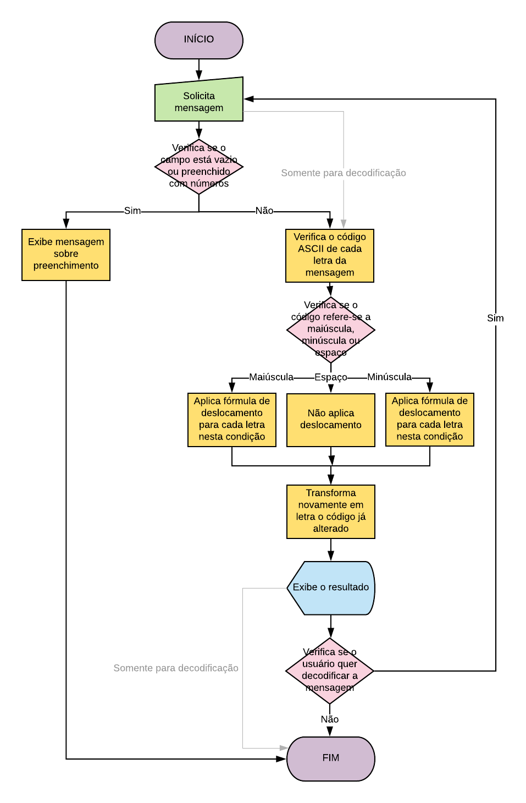

# Cesar Cipher

## Motivation 
This was the final product of the first sprint of Laboratoria bootcamp. The challenge was to create a platform to cipher and decipher a message. It was also necessary to describe the entire process in the lines bellow.

### Descrição
A princípio, é solicitado que o usuário digite uma mensagem a ser criptografada. Caso o campo correspondente esteja vazio ou preenchido com números, obtem-se o alerta: "Precisa digitar uma mensagem". Do contrário, iniciam-se os processos e testes, divididos em duas etapas:

#### Cipher
1. Descobrir, através do módulo 'string.charCodeAt()' o código ASCII de cada uma das letras da mensagem inserida pelo usuário; 
2. Verificar se este código se encontra no intervalo de 65 a 90 (referente às letras maiúsculas do alfabeto), ou entre 97 e 122 (referente às letras minúsculas), ou ainda se corresponde ao número 32, que é o espaço;
3. Às letras da condição anterior, é aplicada a fórmula da Cifra de César, que soma o código ASCII com o deslocamento e, em seguida, executa o módulo 26 neste resultado. O espaço mantém o mesmo código;
4. O próximo passo retorna, utilizando o módulo 'String.fromCharCode()', as letras correspondentes a esses novos códigos. Esta sequência é guardada em um array e posteriormente reagrupada;
5. Ao final, a mensagem é exibida na tela, juntamente com um botão que dá início à função 'decipher()', caso o usuário tenha interesse em visualizar o texto em seu estado original.

#### Decipher
A decodificação segue as mesmas etapas: recebe do usuário o texto a ser substituído, identifica os códigos de cada letra, verifica seus intervalos e aplica a estes a fórmula da Cifra de César para descriptografia que, ao invés de somar ao código ASCII o valor do deslocamento, vai subtraí-lo e, de forma semelhante, executar o módulo 26 ao final. Da mesma forma, faz-se necessário reverter os novos códigos para as letras correspondentes e, então, exibe-se o resultado na tela.

### Fluxograma
